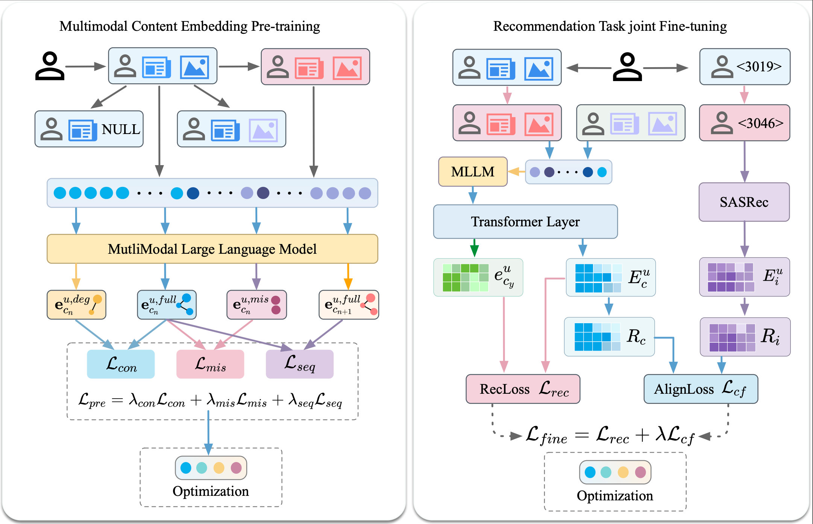
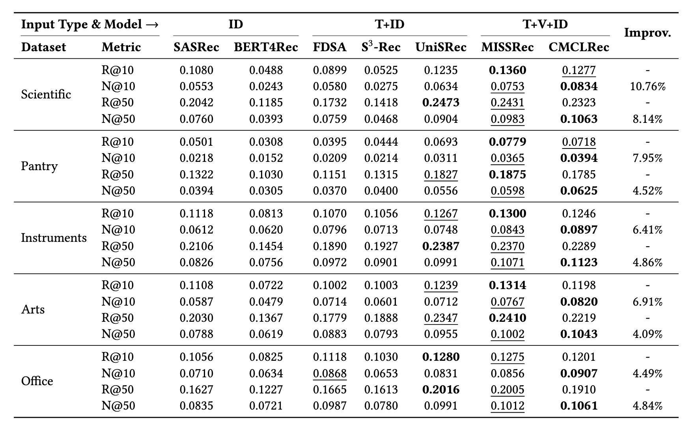

# CMCLRec

一个基于双分支序列推荐模型（ID 分支 + 内容分支）的多模态推荐实验项目。

## 1. 准备工作

### 1.1 数据集图片
本仓库中的 `data/<dataset>/` 默认只保留了 `*.txt` 与 `*.json` 索引文件。  
请先自行下载对应数据集的图片，并放回各数据集目录下的图片文件夹（如 `*_photos/`）。

### 1.2 视觉嵌入模型
请下载 **Qwen3.5-VL-Embedding**，并放到：

```bash
Embedding/
```

确保目录下包含模型权重与 tokenizer 等文件（例如 `model.safetensors`、`config.json`、`tokenizer.json` 等）。

## 2. 评估命令

使用以下命令进行评估（示例为 `office` 数据集）：

```bash
python src/main.py --data_name office --model_idx 0 --do_eval
```

你也可以将 `office` 替换为其他数据集名称（如 `arts`、`pantry`、`scientific` 等）。

## 3. 图示说明

### 3.1 框架图
`framework.png` 展示了本方法的整体框架与双分支建模流程。



### 3.2 实验图
`experiment.png` 展示主要实验结果与对比结论。



